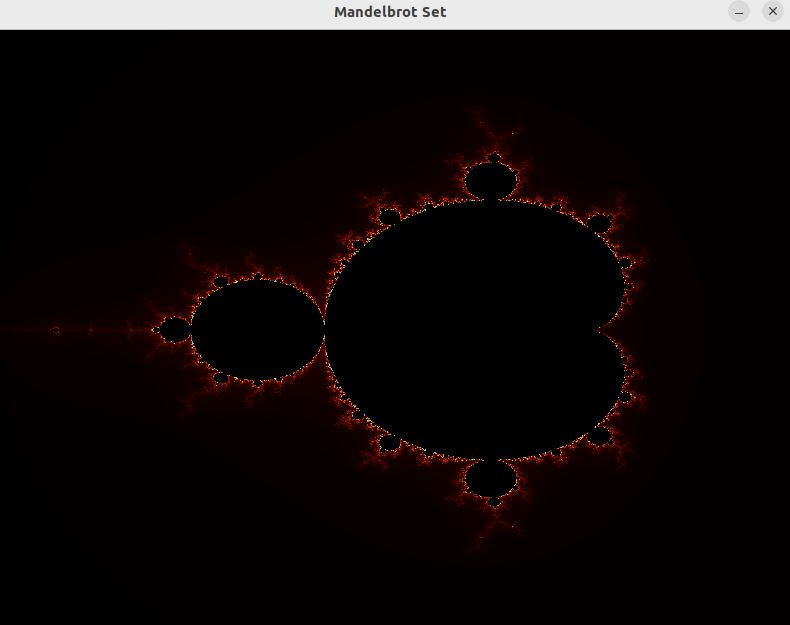
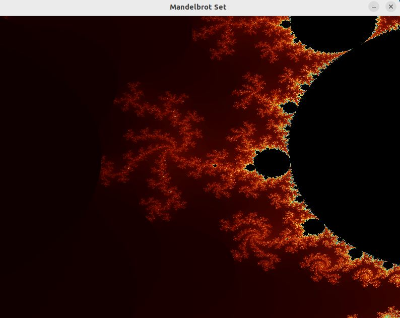
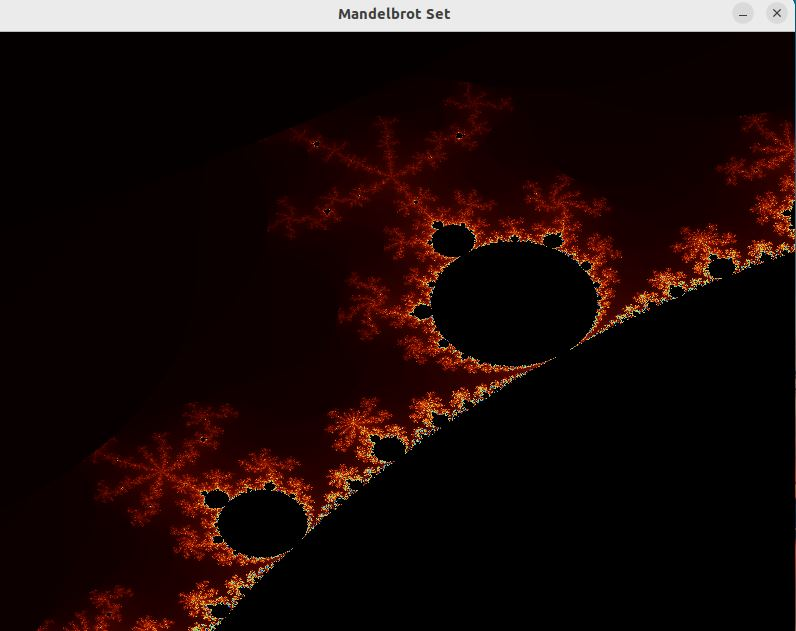
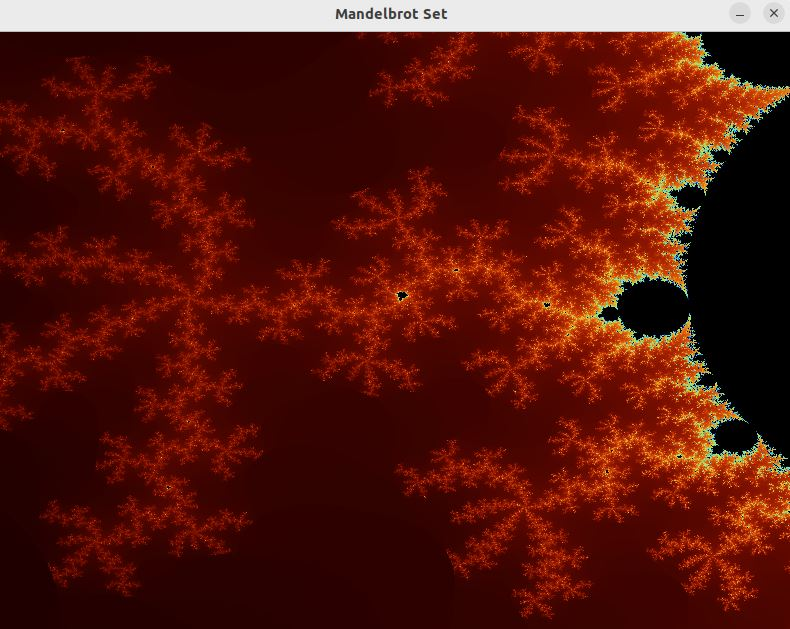
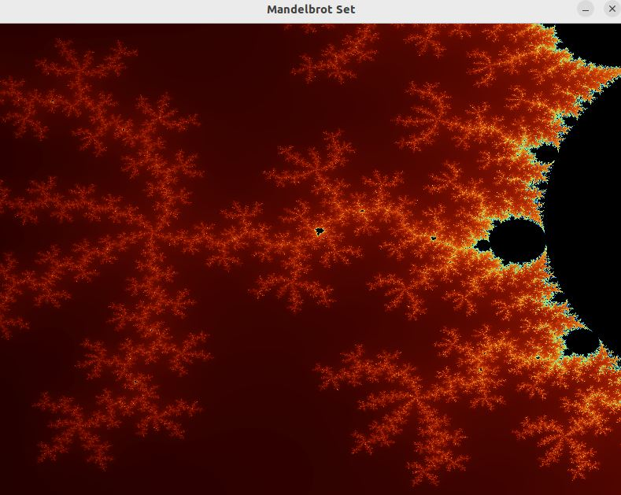

# CppND-Program-Capstone-Project
Mandelbrot Set in C++ with OpenCV

## Overview
This is the capstone project for the Udacity C++ Nanodegree Program. I implemented a simple Mandelbrot Set and then display it by OpenCV library .The program calculate Mandelbrot set from argurments and display as image.
We can Zoom In/Out and improve quality of image display and then saved as into  local computer. The program is run through the command line and without takes options and input parameters.

## File Structure
This repository contains:

- `include/` : Constains the header files `ComplexNumber.h`, `ImageGenerator.h`, `Mandelbrot.h`, `UserInterface.h` files.

- `src/` : Source. Constains the `main.cpp`, `ComplexNumber.cpp`, `ImageGenerator.cpp`, `Mandelbrot.cpp`, `UserInterface.cpp` files.

- `output/` : Image file of the program will be generated.

- `CMakeLists.txt` : cmake configuration file

- `README.md` : This file

## Dependencies for Running Locally
* cmake >= 3.26.4
  * All OSes: (https://cmake.org/install/)
* make >= 4.3 
  * All OSes: (https://www.mingw-w64.org/downloads/)
* OpenCV >= 4.x
  * The OpenCV source code: (https://github.com/opencv/opencv.git))
* gcc/g++ >= 5.4
  * Linux: gcc / g++ is installed by default on most Linux distros
  * Mac: [install Xcode command line tools](https://developer.apple.com/xcode/features/)
  * Windows:  [MinGW](http://www.mingw.org/)

## Build Instructions
1. Clone this repo using `git clone https://github.com/vietanha74/CppND-Program-Capstone-Project.git`
2. Enter the root directory of the repository using `cd CppND-Program-Capstone-Project`
3. `mkdir build && cd build`
4. `cmake ..`
5. `make`

## Run
In `build` directory, run the executable like below:
`./MandelbrotSet`

## Executable: 
`Zoom in`: Press [left mouse] button to Zoom in with factor : 0.5

`Zoom out`: Press [right mouse] button to Zoom in with factor : 2.0

`Space key`: Press [Space] key on to improve quality of MandelbrotSet image

- `Before`

- `After`

`Ctrl + S`: To save image as default of OS.

## Rubric
__README (All Rubric Points REQUIRED)__

|DONE | CRITERIA | MEETS SPECIFICATIONS| WHERE |
|-- | -- | --| -- |
| :heavy_check_mark:| A README with instructions is included with the project |The README is included with the project and has instructions for building/running the project. If any additional libraries are needed to run the project, these are indicated with cross-platform installation instructions. You can submit your writeup as markdown or pdf.| |
| :heavy_check_mark: | The README indicates which project is chosen. | The README describes the project you have built. The README also indicates the file and class structure, along with the expected behavior or output of the program. | |
| :heavy_check_mark: | The README includes information about each rubric point addressed. | The README indicates which rubric points are addressed. The README also indicates where in the code (i.e. files and line numbers) that the rubric points are addressed. | |

__Compiling and Testing (All Rubric Points REQUIRED)__

|DONE | CRITERIA | MEETS SPECIFICATIONS| WHERE |
|-- | -- | --| -- |
| :heavy_check_mark: | The submission must compile and run. | The project code must compile and run without errors. We strongly recommend using cmake and make, as provided in the starter repos. If you choose another build system, the code must compile on any reviewer platform. |

__Loops, Functions, I/O__

|DONE | CRITERIA | MEETS SPECIFICATIONS| WHERE |
|-- | -- | --| -- |
| :heavy_check_mark: | The project demonstrates an understanding of C++ functions and control structures.| A variety of control structures are used in the project. The project code is clearly organized into functions.| Every *.cpp file |
|  | The project reads data from a file and process the data, or the program writes data to a file. |  |
|  | The project accepts user input and processes the input.|The project accepts input from a user as part of the necessary operation of the program.|   |

__Object Oriented Programming__

|DONE | CRITERIA | MEETS SPECIFICATIONS| WHERE |
|-- | -- | --| -- |
| :heavy_check_mark: | The project uses Object Oriented Programming techniques. | The project code is organized into classes with class attributes to hold the data, and class methods to perform tasks. | All *.cpp and *.h files |
| :heavy_check_mark: | Classes use appropriate access specifiers for class members. | All class data members are explicitly specified as public, protected, or private.| All *.cpp and *.h files |
| :heavy_check_mark: | Class constructors utilize member initialization lists. | All class members that are set to argument values are initialized through member initialization lists.| All *.cpp and *.h files |
| :heavy_check_mark: | Classes abstract implementation details from their interfaces. | All class member functions document their effects, either through function names, comments, or formal documentation. Member functions do not change program state in undocumented ways.| All *.cpp and *.h files |
| :heavy_check_mark: | Classes encapsulate behavior. | Appropriate data and functions are grouped into classes. Member data that is subject to an invariant is hidden from the user. State is accessed via member functions.| All *.cpp and *.h files |
| | Classes follow an appropriate inheritance hierarchy. | Inheritance hierarchies are logical. Composition is used instead of inheritance when appropriate. Abstract classes are composed of pure virtual functions. Override functions are specified.|  |
|  | Overloaded functions allow the same function to operate on different parameters. |  |
|  | Derived class functions override virtual base class functions. |One member function in an inherited class overrides a virtual base class member function.| |
|  | Templates generalize functions in the project. | One function is declared with a template that allows it to accept a generic parameter.| Done so with in buffer.h|

__Memory Management__

|DONE | CRITERIA | MEETS SPECIFICATIONS| WHERE |
|-- | -- | --| -- |
| :heavy_check_mark: | The project makes use of references in function declarations. | At least two variables are defined as references, or two functions use pass-by-reference in the project code.|Extensively done so in multiple functions in object_detector.h |
| :heavy_check_mark: | The project uses destructors appropriately. | At least one class that uses unmanaged dynamically allocated memory, along with any class that otherwise needs to modify state upon the termination of an object, uses a destructor. | input.h for class Input|
|  | The project uses scope / Resource Acquisition Is Initialization (RAII) where appropriate. | The project follows the Resource Acquisition Is Initialization pattern where appropriate, by allocating objects at compile-time, initializing objects when they are declared, and utilizing scope to ensure their automatic destruction.| |
|  | The project follows the Rule of 5. | For all classes, if any one of the copy constructor, copy assignment operator, move constructor, move assignment operator, and destructor are defined, then all of these functions are defined.| Done in object_detector.h for class ObjectDetector |
|  | The project uses move semantics to move data, instead of copying it, where possible. | For classes with move constructors, the project returns objects of that class by value, and relies on the move constructor, instead of copying the object. | Done in object_detector.cpp for class ObjectDetector  |
|  | The project uses smart pointers instead of raw pointers. | The project uses at least one smart pointer: unique_ptr, shared_ptr, or weak_ptr. The project does not use raw pointers.| used in main.cpp |

__Concurrency__

|DONE | CRITERIA | MEETS SPECIFICATIONS| WHERE |
|-- | -- | --| -- |
| :heavy_check_mark: | The project uses multithreading. | The project uses multiple threads in the execution.| |
|  | A promise and future is used in the project. | A promise and future is used to pass data from a worker thread to a parent thread in the project code.| |
| :heavy_check_mark: | A mutex or lock is used in the project. | A mutex or lock (e.g. std::lock_guard or `std::unique_lock) is used to protect data that is shared across multiple threads in the project code.| used in Buffer extensively |
|  | A condition variable is used in the project. | A std::condition_variable is used in the project code to synchronize thread execution.| |
